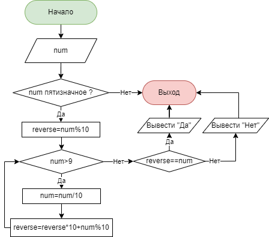

# Знакомство с языками программирования (семинары)

## Урок 3. Массивы и функции в программировании

### **Задача 19:** ###

Напишите программу, которая принимает на вход пятизначное число и проверяет, является ли оно палиндромом.

14212 -> нет

12821 -> да

23432 -> да

### Примечания к реализации ###

Алгоритм проверки построен на проверке на равентство входного числа и его реверса. Если эти числа равны, то входное число является палиндромом.

Основной частью программы является метод `Reverse`, который принимает на вход число, а возвращает его реверс: 12345 -> 54321. 

Данный алгоритм применим к числам произвольной разрядности, но т.к. в условиях задачи указано пятизначное число, то в начале производится проверка на разрядность введеного числа.

